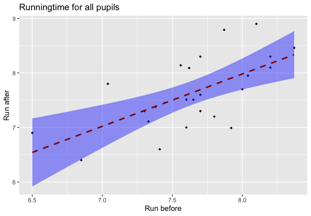

# EDDA: Assignment 1
*Throughout this assignment tests should be performed using a level of 0.05, unless otherwise specified.*

## Exercise 1. Power function of the t-test:white_check_mark:
We study the power function of the two-sample t-test (see Section 1.9 of Assignment 0). For n=m=30, mu=180, nu=175 and sd=5, generate 1000 samples x=rnorm(n,mu,sd) and y=rnorm(m,nu,sd), and record the 1000 p-values for testing H0: mu=nu. You can evaluate the power (at point nu=175) of this t-test as fraction of p-values that are smaller than 0.05.

1. Set n=m=30, mu=180 and sd=5. Calculate now the power of the t-test for every value of nu in the grid seq(175,185,by=0.25). Plot the power as a function of nu.:white_check_mark:
2. Set n=m=100, mu=180 and sd=5. Repeat the preceding exercise. Add the plot to the preceding plot.:white_check_mark:
3. Set n=m=30, mu=180 and sd=15. Repeat the preceding exercise.:white_check_mark:
4. Explain your findings. *High n/m(observations) + low sd = best power, low n/m + low sd = can still have good power, low n/m AND low sd = little power*:white_check_mark:

## Exercise 2. Speed of light
In 1849 and 1850, the French physicists Fizeau and Foucault had separately devised methods of measuring the velocity of light. Foucault’s method, as refined and improved by Newcomb and Michelson, was the source of the more accurate subsequent determinations. Foucault’s method consists in essence of passing light from a source off a rapidly rotating mirror to a distant fixed mirror, and back to the rotating mirror. The velocity of light is then determined by measuring the distance involved, the speed of the rotating mirror and the angular displacement of the received image from its source.

In 1879 Michelson performed 100 experiments to determine the speed of light and in 1882 another 23 experiments. The measurements in km/sec minus 299000 are given in the file light1879.txt and light1882.txt, respectively. The file light.txt contains Newcomb’s measurements (made in 1882 on three different days: the first 20 measurements on day 1, the next 20 on day 2, the last 26 on day 3) of the passage time it took light to travel the distance 7.442 km, The coding of Newcomb’s measurements is as follows: from the original times in microseconds measured by Newcomb first 24.8 was subtracted, after which the results were multiplied with 1000.

1. Investigate the normality for all three data sets.
2. Determine confidence intervals for the speed of light in km/sec for all three data sets (use population
means). Comment on the intervals found.
3. Find on the internet the currently most accurate value for the speed of light. Is it consistent with the
measurements of Michelson and Newcomb?

## Exercise 3. Telecommunication company
A telecommunication company has entered the market for mobile phones in a new country. The company’s marketing manager conducts a survey of 200 new subscribers for mobile phones. The results of the survey are in the data set telephone.txt, which contains the first month bills X1 , . . . X200 , in euros.

1. Make an appropriate plot of this data set. What marketing advice(s) would you give to the marketing manager? Are there any inconsistencies in the data? If so, try to fix these.
:white_check_mark:

_Advice:
There are a lot of bills very small bills (smaller than 20$) and a lot of bills between 90$ and 100$. Advice would be to focus on these two groups: the group of people who don't have any bills or only small bills and the group of people with bills between 80$ - 110$._

2. By using a bootstrap test with the test statistic T = median(X1,...,X200), test whether the data telephone.txt stems from the exponential distribution Exp(λ) with some µλ from [0.01, 0.1].

  _T = 26.9;
  p-value = 0.00162. It can be concluded that the data does not follow an exponential distribution with some λ from [0.01, 0.1]._
  :white_check_mark:
  

3. Construct a 95% bootstrap confidence interval for the population median of the sample.  :white_check_mark:

  _The 95% confidence interval is [38.2  48.8]._

4. Assuming X1 , . . . Xn ∼ Exp(λ) and using the central limit theorem for the sample mean, estimate λ and construct again a 95% confidence interval for the population median. Comment on your findings.:x:

5. Using an appropriate test, test the null hypothesis that the median bill is bigger or equal to 40 euro against the alternative that the median bill is smaller than 40 euro. Next, design and perform a test
to check whether the fraction of the bills less than 10 euro is at most 25%.:white_check_mark:

  _Pvalue(bigger or equal to 40) = 0.415;
  Pvalue(smaller than 40) =  0.585; (or 1 - 0.415)_

  _So, H0 is not rejected, the median is not bigger or equal to 40 and not smaller than 40 euro._

  _The fraction of bills less than 10 euro is 26%._

## Exercise 4. Energy drink
To study the effect of energy drink a sample of 24 high school pupils were randomized to drinking either a softdrink or an energy drink after running for 60 meters. After half an hour they were asked to run again. For both sprints they were asked to sprint as fast they could, and the sprinting time was measured. The data is given in the file run.txt. [Courtesy class 5E, Stedelijk Gymnasium Leiden, 2010.]

1. Disregarding the type of drink, test whether the run times before drink and after are correlated.:white_check_mark:
  
  _At glance, there is a relationship between the two experiments. As the runningtime before increases, the runningtime after also increases._
  _Data is normally distributed, so a Pearson’s product-moment correlation can be executed. p-value = 0.00078 and r=0.639. There is a significant correlation of 0.639_  

2. Test separately, for both the softdrink and the energy drink conditions, whether there is a difference
in speed in the two running tasks.:white_check_mark:

  _p-value for lemo-group = 0.4; p_value for energy-group = 0.1; So, for both groups, H0 is not rejected: the mean of the differences is not different from 0._

3. For each pupil compute the time difference between the two running tasks. Test whether these time differences are effected by the type of drink.:white_check_mark:

  _Independent t-test gives a p-value of 0.2, so H0 is rejected; the differences are not effected by the type of drink._

4. Can you think of a plausible objection to the design of the experiment in b) if the main aim was to test
whether drinking the energy drink speeds up the running? Is there a similar objection to the design of the experiment in c)? Comment on all your findings in this exercise.:white_check_mark:

  _First of all, it has been shown that there is a significant correlation of 0.693, indicating that the speed of running after an energy drink is correlated to the speed of running before the drink. An explanation for this finding could be the fact that experiment 1 and 2 are conducted by the same person. If a pupil already starts with a fast runningtime, this pupil is likely to also end with a fast runningtime._

  * _Other factors could have influenced the results, such as actions during resting time._
  * _The number of pupils could have been small. The statistical significance of any statistic is only partly due to its size, it's also a function of sample size._
  * _Data is missing about how much lemonade or energy the pupils drank. It is possible that the variance of the amount is very high, what could have influence the results._
  * _For experiment c: A T-test between the two groups showed that there is no difference between experiment 1 and experiment 2. This indicates that there may also not be a difference between the two experiments when testing if the type of energy drink speeds up the running._

## Exercise 5. Chick weights
The dataset chickwts is a data frame included in the standard R installation, to view it, type chickwts at the R prompt. This data frame contains 71 observations on newly-hatched chicks which were randomly allocated among six groups. Each group was given a different feed supplement for six weeks, after which their weight (in grams) was measured. The data frame consists of a numeric column giving the weights, and a factor column giving the name of the feed supplement.

1. Test whether the distributions of the chicken weights for meatmeal and sunflower groups are different by performing three tests: the two samples t-test (argue whether the data are paired or not), the Mann-Whitney test and the Kolmogorov-Smirnov test. Comment on your findings.
2. Conduct a one-way ANOVA to determine whether the type of feed supplement has an effect on the weight of the chicks. Give the estimated chick weights for each of the six feed supplements. What is the best feed supplement?
3. Check the ANOVA model assumptions by using relevant diagnostic tools.
4. Does the Kruskal-Wallis test arrive at the same conclusion about the effect of feed supplement as the
test in b)? Explain possible differences between this conclusion and the conclusion from b).
